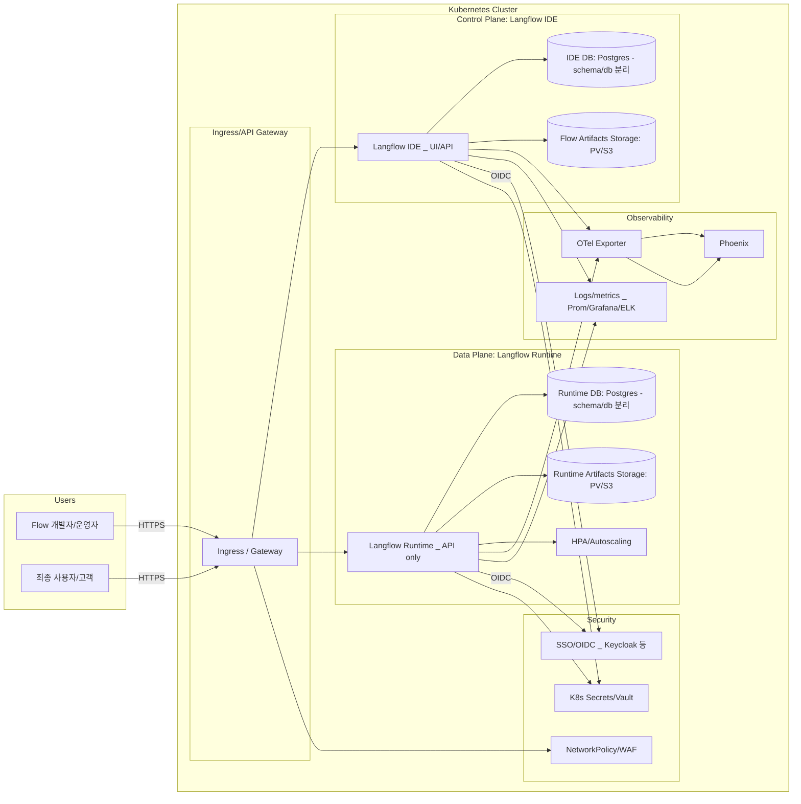

아래 문서를 **블로그용 글**로 다시 정리했습니다.
보고서 톤을 줄이고, 흐름 중심으로 쉽게 읽히도록 재구성했습니다.
(원본 문서는  기반으로 수정했습니다.)

---

# Kubernetes(Helm) 기반 Langflow PoC 정리

Langflow를 Kubernetes에 Helm으로 배포해보면서 정리한 기술 검증(PoC) 내용입니다.
목표는 단순 배포가 아니라 **멀티 인스턴스 운영이 가능한 표준화된 구조를 만드는 것**이었습니다.

이 글에서는:

* Helm 주요 설정 포인트
* 운영 환경에서 반드시 고려해야 할 부분
* Ingress 기반 멀티테넌트 설계
* 운영 시 권장 설정

을 정리합니다.

---

# 1. Helm으로 Langflow 배포할 때 가장 중요한 것

핵심은 아래 4가지입니다.

1. 리소스 이름 규칙
2. 이미지 버전 고정
3. 외부 DB 사용
4. 스토리지 영속성 확보

이 4개가 정리되지 않으면 운영 환경에서 반드시 문제가 생깁니다.

---

# 2. 리소스 이름 관리 (nameOverride / fullnameOverride)

Helm은 기본적으로 릴리스 이름을 기준으로 리소스를 생성합니다.

하지만 멀티테넌트 환경에서는 이 방식이 금방 혼란을 만듭니다.

### 추천 방식

`fullnameOverride`를 사용하세요.

```yaml
fullnameOverride: data-science-langflow-dev
```

### 추천 네이밍 패턴

```
[팀/프로젝트]-[서비스]-[환경]
```

예시:

* data-science-langflow-dev
* llm-platform-langflow-prod

이렇게 하면 클러스터에서 리소스 소유와 목적이 바로 보입니다.

---

# 3. 이미지 설정 — 반드시 버전 고정

기본 설정은 보통 `latest` 입니다.

```yaml
repository: langflowai/langflow
tag: latest
```

운영 환경에서 `latest`는 절대 사용하지 마세요.

왜 위험한가?

* 자동 업데이트
* 예기치 않은 버전 변경
* 프론트/백엔드 호환성 문제

### 권장 방식

```yaml
tag: "1.0.0"
```

그리고 Helm 차트 기본 values에 명시된 이미지 버전을 먼저 확인하세요.
그 버전이 해당 차트와 테스트된 기본 조합입니다.

---

# 4. 데이터베이스 설정

## 4.1 운영 환경 = 외부 PostgreSQL 필수

```yaml
externalDatabase:
  enabled: true
  driver: postgresql
  host:
    value: langflow-postgres-postgresql.langflow-dev.svc.cluster.local
  port:
    value: "5432"
  user:
    value: langflow
  password:
    value: langflow-pass
  database:
    value: langflow_db_b
```

### 중요한 보안 포인트

values.yaml에 비밀번호를 직접 넣는 것은 위험합니다.

가장 안전한 방법:

* Kubernetes Secret 사용
* SOPS / Helm Secrets 사용
* Vault 연동

values.yaml에 넣는다면 해당 파일 자체를 비밀 자산으로 관리해야 합니다.

---

## 4.2 테스트용 = SQLite 가능

```yaml
externalDatabase:
  enabled: false

sqlite:
  enabled: true
  volume:
    size: 1Gi
```

SQLite는 빠른 테스트용입니다.
운영에는 권장하지 않습니다.

---

# 5. 스토리지 — emptyDir 쓰면 데이터 날아갑니다

현재 기본 예시는 이런 구조입니다.

```yaml
emptyDir: {}
```

문제:

Pod가 삭제되면 데이터도 삭제됩니다.

즉,

* flow
* SQLite DB
* 사용자 데이터

모두 사라집니다.

---

## 해결 방법 — PersistentVolume 사용

### 방법 1. StorageClass 기반 동적 프로비저닝

```yaml
persistence:
  enabled: true
  storageClassName: "gp2"
  size: 5Gi
```

클라우드 환경에서 가장 일반적인 방식입니다.

---

### 방법 2. NFS (NAS 연동)

멀티 Pod 접근이 필요하면 `ReadWriteMany`가 필요합니다.

PV 예시:

```yaml
accessModes:
  - ReadWriteMany
```

이 방식은 온프레미스 환경에서 많이 사용됩니다.

---

# 6. Phoenix 연동 (OpenTelemetry)

Langflow에서 tracing을 활성화하면 Phoenix로 trace를 보낼 수 있습니다.

```yaml
env:
  - name: LANGFLOW_TRACING
    value: "true"
  - name: OTEL_EXPORTER_OTLP_PROTOCOL
    value: "http/protobuf"
  - name: PHOENIX_COLLECTOR_ENDPOINT
    value: "http://phoenix-a-svc:6006"
```

중요 포인트:

* endpoint에는 `/v1/traces`를 직접 붙이지 않는 경우가 일반적
* exporter가 내부적으로 처리함
* protocol은 http/protobuf가 무난

운영에서는 반드시 API Key도 Secret로 관리해야 합니다.

---

# 7. 리소스 설정 (CPU / Memory)

기본 예시:

```yaml
requests:
  cpu: 0.5
  memory: 1Gi
```

운영에서는 반드시:

* limits 설정
* Prometheus/Grafana로 모니터링
* 실제 사용량 기반 조정

이 과정을 거쳐야 합니다.

---

# 8. Ingress 설계 — 멀티테넌트 핵심

### 추천: Host 기반 라우팅

```
langflow-team-a.company.com
langflow-team-b.company.com
```

왜 Path 기반보다 좋은가?

* 내부 라우팅 충돌 없음
* 구조 단순
* 확장 용이

Ingress 예시:

```yaml
ingress:
  enabled: true
  hosts:
    - host: langflow-team-a.company.com
      paths:
        - path: /
```

멀티 인스턴스 운영 시 가장 안정적인 방식입니다.

---

# 9. 정리 — 운영 환경에서 반드시 지켜야 할 것

✔ fullnameOverride로 명확한 네이밍
✔ 이미지 버전 고정
✔ 외부 PostgreSQL 사용
✔ PersistentVolume 적용
✔ Secret으로 자격 증명 관리
✔ Host 기반 Ingress 사용
✔ 리소스 limits 설정

이 7개가 정리되면 운영 안정성이 확보됩니다.

---

# 마무리

이번 PoC의 결론은 단순합니다.

Langflow는 Helm으로 충분히 멀티 인스턴스 운영이 가능하지만,
운영 수준으로 가려면 반드시 **스토리지, 버전 고정, 보안, 네이밍 전략**을 먼저 설계해야 합니다.

기술적으로 어려운 부분은 많지 않지만,
운영 설계를 먼저 하지 않으면 나중에 구조를 뜯어고쳐야 합니다.

---

가설로 다이어그램 작성해봅시다. 

